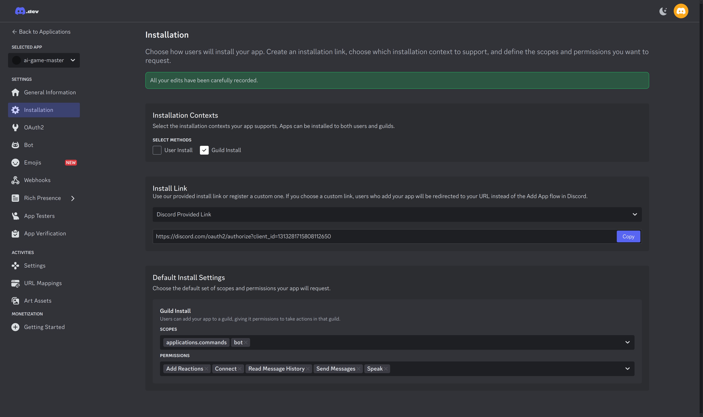
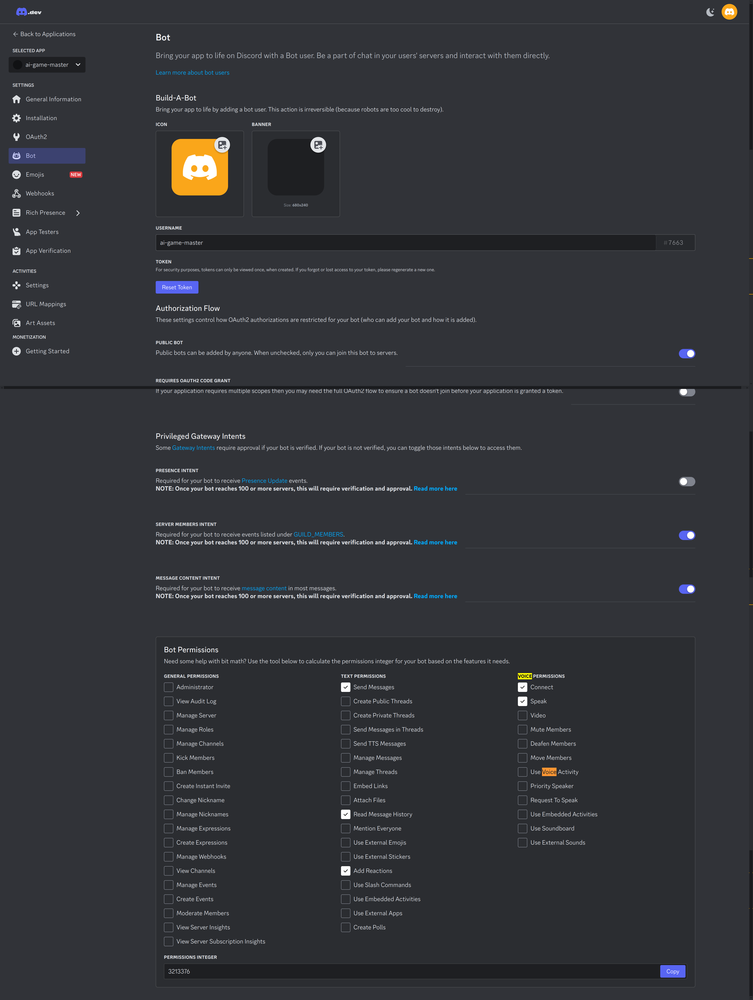

# Discord

## Bot Configuration 

### Installation

https://discord.com/developers/applications/1313281715808112650/installation

- Installation Contexts: 
    - Guild Install: On 
    - User Install: Off
- Install link
    - _use it to add the bot to a server without using the store_
-  Default install settings
    - Guild Install
        - Scope: applications.commands + bot 
        - Permissions:
            - Add Reactions _(=emoticons.)_
            - Connect _(to join voice channels.)_
            - Speak
            - Read message history
            - Send message

### bot

https://discord.com/developers/applications/1313281715808112650/bot

- Server Members Intent: On
- Message Content Intent: On
- Bot Permissions : Irrelevant, only a calculator

### oauth2

Irrelevant

